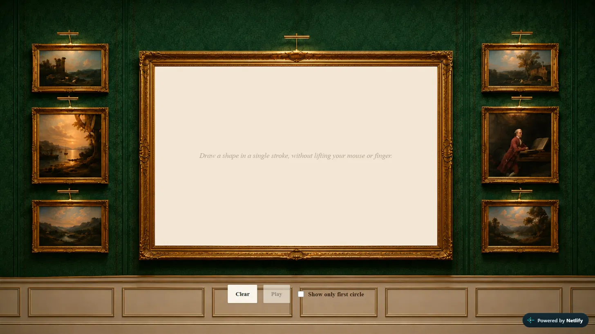

# Draw Something

A canvas drawing app that turns your sketch into an animated [Fourier series](https://en.wikipedia.org/wiki/Fourier_series) — draw any shape in one continuous stroke, and watch it get retraced by a chain of rotating epicycles (the same trick behind those "drawing with circles" videos).

**Live demo:** [draw-something-ft.netlify.app](https://draw-something-ft.netlify.app/)

<p align="center">
  
  
</p>

## How it works

1. Draw any closed or open shape on the canvas in a single continuous motion.
2. On release, your stroke's points are converted into a complex-valued signal and run through a [discrete Fourier transform](https://youtu.be/spUNpyF58BY?si=LR2QE6eJetzkNfoa).
3. The resulting frequency components are rendered as a chain of rotating circles (epicycles) — the tip of the chain retraces your original drawing.
4. Use **Pause/Play** to stop and resume the animation, and **Show only first circle** to see just the dominant frequency component in isolation.

## Tech stack

- [React](https://react.dev/) + [Vite](https://vitejs.dev/)
- HTML5 Canvas for drawing and rendering
- A custom DFT implementation (`src/utils/fourier.js`)
- Plain CSS — no UI framework

## Running locally

```bash
git clone https://github.com/ishika-sancheti/draw-something-app.git
cd draw-something-app
npm install
npm run dev
```

Then open the local URL printed in your terminal (typically `http://localhost:5173`).

## Project structure

```
draw-something-app/
├── public/
│   └── gallery-wall.png      # background artwork
├── src/
│   ├── main.jsx
│   ├── App.jsx
│   ├── App.css
│   ├── index.css
│   ├── components/
│   │   └── Canvas.jsx        # drawing surface, toolbar, animation loop
│   └── utils/
│       └── fourier.js        # discrete Fourier transform
├── index.html
├── package.json
└── vite.config.js
```

## Building for production

```bash
npm run build
```

Outputs a production build to `dist/`, ready to deploy to any static host (this project is deployed on [Netlify](https://www.netlify.com/)).

## License

MIT
